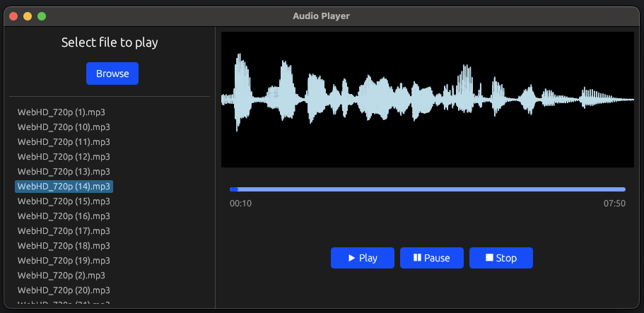

<div align="center">

# 🎧 Audio Player


<br>



</div>

---

A modern, lightweight, and intuitive audio player crafted with Rust, leveraging the power of the [eframe](https://github.com/emilk/egui/tree/master/crates/eframe) and [egui](https://github.com/emilk/egui) GUI frameworks. Designed to be feature-rich yet minimalistic, this audio player provides excellent performance and responsive UI, suitable for easily playing your favorite tracks in a seamless experience.

## 🚀 Features

- **Intuitive UI:** Navigate your music effortlessly in an elegant and responsive graphical user interface.
- **Directory Scan:** Automatically recognize and load audio files from a specified directory.
- **Waveform Display:** Visualize audio tracks with dynamic, real-time waveform rendering.
- **Playback controls:** Easily play, pause, resume, and stop audio playback.
- **Accurate Playback Tracking:** Keep track of your audio progress accurately through advanced playback time and duration tracking.
- **Cross-platform Compatibility:** Enjoy consistent performance across Windows, macOS, and Linux.

## 🛠️ Technologies Utilized

- **Rust** - Safe and modern systems programming language prioritizing performance and reliability.
- **Rodio** - Powerful audio playback library enhancing consistent playback quality.
- **eframe and egui** - Highly performant GUI frameworks for creating rich desktop applications in Rust.
- **Symphonia** - Robust library used to process and decode diverse audio formats.
- **Hound** - Efficient Rust crate for easy reading and writing of WAV format audio files.
- **RFD** - Cross-platform file dialog handling.

## ⚡ Installation & Running the Project

Clone this repo to your local machine:

```shell
git clone https://github.com/YourUsername/audio-player.git
cd audio-player
```

Run the application using cargo:

```shell
cargo run --release
```

## 📂 Project Structure

```text
📌 audio-player
│
├── 📂 src
│   ├── 📄 main.rs         # Application entry-point
│   ├── 📄 app.rs          # Main GUI logic and interactions
│   ├── 📄 player.rs       # Audio playback logic
│   ├── 📄 waveform.rs     # Waveform visualization logic
│   └── 📂 utils           # Helper utilities
│
├── 📄 Cargo.toml
├── 📄 audio_player.png    # Project screenshot
└── 📄 README.md
```

## 🎯 Future Improvements

- Integration of advanced playlist management features.
- Enhanced audio equalization and customization options.
- Support for additional audio formats and streaming sources.

## 💬 Contributing & Issues 

Feel free to open an issue on GitHub or create a pull request with improvements or new features.

## 📜 License

This project is licensed under the MIT License - see the [LICENSE](https://opensource.org/licenses/MIT) file for details.

---

🌟 **Showcased as an example of efficient, scalable, and visually appealing GUI applications built using Rust.**